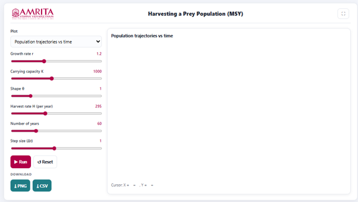
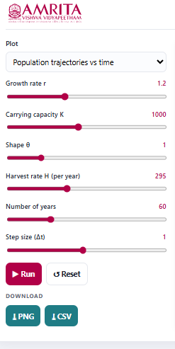
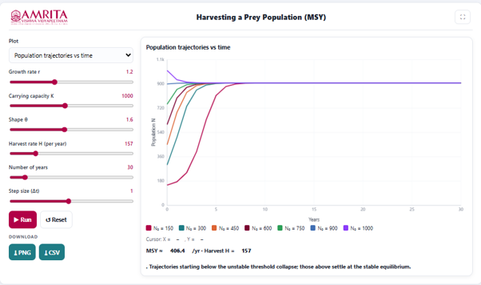

### Procedure

1. The simulator enables users to investigate the effects of harvesting on a prey population using the Maximum Sustainable Yield (MSY) concept. Users can configure population growth, carrying capacity, harvest rate, and simulation duration, execute the simulation, and analyze how different harvesting intensities influence population trajectories and long-term sustainability.

 
&nbsp;

2. The simulator consists of a parameter panel on the left and a graphical visualization panel on the right for displaying the selected simulation output.

 
&nbsp;

3. Select the desired graphical output from the Plot drop-down menu. The simulator provides different graphical representations for analysing prey population dynamics under harvesting. Select the required plot for the intended analysis.
 
&nbsp;

4. Adjust the intrinsic growth rate (r) using the corresponding slider. This parameter represents the natural rate at which the prey population increases in the absence of harvesting.
 
&nbsp;

5. Specify the carrying capacity (K) using the Carrying capacity slider. This parameter defines the maximum population size that the environment can sustainably support.

&nbsp;

6. Adjust the shape parameter (θ) using the corresponding slider. This parameter modifies the growth curve of the prey population and influences the way the population approaches its carrying capacity.
 
&nbsp;

7. Specify the harvest rate (H per year) using the corresponding slider. This parameter defines the number of individuals removed from the prey population annually through harvesting and enables the investigation of different harvesting intensities.
 
&nbsp;

8. Set the duration of the simulation using the Number of years slider. This parameter determines the total simulation period over which the prey population dynamics are evaluated.
 
&nbsp;

9. Adjust the simulation step size (Δt) using the corresponding slider. This parameter specifies the numerical time interval used in solving the population growth equations. Smaller values generally improve the numerical accuracy and stability of the simulation.
 
&nbsp;

10. After configuring all simulation parameters, click the Run button to execute the simulation and generate the selected graphical output.

 
&nbsp;

11. Observe the graph displayed in the visualization panel. The graph illustrates the changes in prey population size over time for multiple initial population sizes under the selected harvesting conditions.
 
&nbsp;

12. Interpret the X-axis (Years) to determine the progression of the simulation and the Y-axis (Population, N) to examine changes in prey population size throughout the simulation period.
 
&nbsp;

13. Use the graph legend to distinguish the population trajectories corresponding to different initial population sizes (N₀).
 
&nbsp;

14. Compare the trajectories to observe how populations starting at different initial sizes respond to the same harvesting rate. Identify whether each population approaches a stable equilibrium, remains relatively constant, or declines over time.
 
&nbsp;

15. Observe the equilibrium behaviour of the population trajectories to determine whether the selected harvesting rate allows the prey population to recover and stabilize or causes the population to decline toward extinction.
 
&nbsp;

16. Examine the Maximum Sustainable Yield (MSY) value displayed below the graph. Compare the selected harvest rate (H) with the calculated MSY to determine whether harvesting is within sustainable limits.
 
&nbsp;

17. Read the interpretation message displayed beneath the graph. This message summarizes the simulation outcome by indicating whether populations above the unstable threshold converge to a stable equilibrium, whereas populations below the threshold collapse under the selected harvesting pressure.
 
&nbsp;

18. Move the cursor over the graph, if required, to display the corresponding coordinate values shown beneath the graph. These values indicate the population size at a particular simulation year.
 
&nbsp;

19. Modify one or more simulation parameters, such as the growth rate (r), carrying capacity (K), shape parameter (θ), harvest rate (H), or simulation duration, and execute the simulation again to investigate how these factors influence population persistence and harvesting sustainability.
 
&nbsp;

20. Compare the simulation results obtained under different harvest rates to identify the harvesting level that maximizes sustainable yield while maintaining long-term population stability.
 
&nbsp;

21. If required, click the Reset button to restore the default simulation parameters before performing another simulation.
 
&nbsp;

22. Download the graphical output by clicking the PNG button or export the numerical simulation data by clicking the CSV button for further quantitative analysis and comparison.
 
&nbsp;

23. Repeat the above procedure using different combinations of growth rate, carrying capacity, harvest rate, and initial population size to compare population trajectories and determine the ecological conditions under which sustainable harvesting can be achieved.

